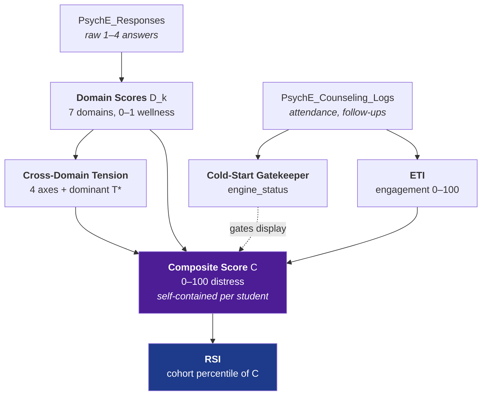

# PsychE Analytics Engine — Complete Overview

> **Status of this file:** orientation / reading guide. It explains *how the layers fit together and why*.
> **It is not the owner of any rule.** Exact formulas, column definitions, and thresholds are owned by
> `docs/ARCH_technical-specs.md` §8; UI presentation rules are owned by `docs/GUIDE_developer.md` §9.
> If this file and those disagree, **they win** — report the drift on the next doc sweep.
>
> Not yet registered in `docs/ARCH_documentation-governance.md` (registration happens only on an explicit doc sweep).
> Last updated: 2026-07-29.

---

## 1. What the engine is for

Every metric here exists to answer one counselor-facing question that the raw records cannot:

| Question | Metric |
|---|---|
| *Which life areas is this student struggling in?* | **Domain Scores** |
| *Is their profile internally consistent, or are they masking?* | **Cross-Domain Tension** |
| *Do we actually know enough about them to say anything?* | **Cold-Start Gatekeeper** |
| *Are they engaging with the support we're offering?* | **ETI** |
| *Overall, how much load are they carrying?* | **Composite Score** |
| *Is that a lot, compared to peers like them?* | **RSI** |

Two design commitments run through all of them:

1. **Missing data is never faked.** Every layer uses an availability coefficient (λ) so an unmeasured
   component is *excised* from its formula — never treated as zero, never silently ignored. If nothing is
   available, the output is `NULL`, not a default.
2. **Absolute and relative measurement stay separate.** Everything except RSI is *criterion-referenced*
   (measured against a fixed standard). RSI alone is *norm-referenced* (measured against peers). Mixing
   them was the source of the one genuine design flaw we hit — see §7.

---

## 2. The pipeline

Strictly one-directional. No stage reads from a stage below it.



Everything left of Composite Score is computed **from one student's own data only**. That is what makes
Composite Score safe to rank across a cohort afterwards.

---

## 3. Layer by layer

### 3.1 Domain Scores — *"which life areas?"*

A **second-order (hierarchical) factor model** — the architecture behind instruments like the WISC
(subtests → index scores → full-scale IQ). Three explicit stages, over a rolling **90-day window**:

**Stage 1 — item → module.** Direction-correct each answer, then average *within each module*:
```
q*  = (scale_min + scale_max) - q   if the question is reverse-scored, else q
q̄_m = mean(q*) for that module
```

**Stage 2 — normalize.** Map onto a dimensionless 0–1 space using **that module's own scale**:
```
Z_m = (q̄_m - scale_min) / (scale_max - scale_min)
```
This is what makes the engine instrument-agnostic. A PHQ-9 or GAD-7 on a different scale range normalizes
correctly the moment its `scale_min`/`scale_max` are set in LibraryManager — no engine change.

**Stage 3 — module → domain.** Weighted mean across modules in that domain:
```
D_k = Σ(Z_m · w_m · λ_m) / Σ(w_m · λ_m)
```
- `w_m` = `PsychE_Modules.domain_weight` — clinical weight, editable per module.
- `λ_m` = 1 if that module was administered in the window, else 0. Implemented by a `GROUP BY module.id`
  subquery that simply produces no row for un-administered modules, so they vanish from **both** numerator
  and denominator.
- If every module in a domain has `λ_m = 0` → `D_k` is `NULL`. Never a default.

**Why two stages instead of one average:** the V5.0 prototype flattened every response straight into a
domain average, so a 20-item module silently outweighed a 5-item one regardless of `domain_weight`. The
per-module mean removes that item-count bias.

**The 7 domains:** BHV Behavioural · SOC Social · COG Cognitive · EMH Emotional · FAM Family ·
CAR Career · SEL Self & Identity.

**Also produced here:** `data_completeness` (non-null domains ÷ 7) and `archetype` (priority-ordered
label — `Pending Baseline Assessment` → `High Vulnerability Support Priority` if EMH and BHV both < 0.35 →
otherwise named for the highest-scoring domain).

---

### 3.2 Cross-Domain Tension — *"consistent, or masking?"*

Divergent profiles are more diagnostic than uniformly low ones. A student at COG 85 / EMH 30 is not
"average" — they are displaying a **masking pattern**, where academic competence conceals distress from
exactly the performance-based monitoring that would otherwise catch it. This layer is a lightweight
approximation of bifactor residual variance: the part a single overall score cannot express by construction.

Four clinically-motivated axes, each computed **only when both domains are non-null**, sign preserved:

| Axis | Formula | Positive means | Negative means |
|---|---|---|---|
| Masking / suppressor | `COG − EMH` | Cognitively intact, emotionally struggling | Cognitive strain — possible learning/attention pathway, not mental-health |
| Escape-valve | `SOC − FAM` | Refuge in peers; home may be the stressor | Stable home, social stressor |
| Authenticity | `CAR − SEL` | Career clearer than identity — externally imposed? | Strong self, undecided path (often developmental) |
| Externalizing ↔ internalizing | `BHV − EMH` | Regulated outwardly, suffering inwardly | Acting out |

**Sign is the whole point** — never collapse to `abs()` before choosing the interpretation. The two
directions imply *different referral pathways*.

**`dominant_tension` = the axis with max |T|**, answering "how internally inconsistent is this profile
overall." Surfaced even below the significance threshold, because "this profile is consistent" is itself
useful information. UI flags individual axes at `|T| > 0.3`.

> V5.0 had only 3 pairs, one of which (`T_internal_external`) was a composite *average* of four domains —
> which destroyed exactly the divergence information this layer exists to preserve. Removed in V6.

---

### 3.3 Cold-Start Gatekeeper — *"do we know enough yet?"*

Guards every other metric against being read as meaningful when it isn't.

| `engine_status` | Condition |
|---|---|
| `cold_start` | 0 completed sessions **and** 0 responses, ever |
| `assessment_only` | Sessions exist, but no formal assessment ever completed |
| `stale` | Last completed session > 90 days ago |
| `warming` | < 15 days since first activity, **or** < 3 completed sessions, **or** < 10 responses |
| `active` | All thresholds cleared |

A separate **frontend-only** display ramp (`calculateConfidenceMultiplier`, `src/analytics/ColdStart.ts`)
drives the "Building profile — N% confidence" badge during `warming`:
`min(1, days/15) × min(1, completed/3)`. It is not stored.

---

### 3.4 ETI — Engagement Trajectory Index — *"are they showing up?"*

Engagement and distress are genuinely separate axes; a student can be moderately distressed and
*disappearing*, which is its own escalation. Over a rolling 30-day window:

```
A = Completed / (Completed + No_Show)                    attendance
F = 1 − (pending follow-ups / total logs in window)       follow-through
R = exp(−days_since_last_completed / 30)                  recency decay
ETI = 100 × (0.50·A + 0.30·F + 0.20·R)
```

`R` decays exponentially — a session today ≈ 1.0, thirty days ago ≈ 0.37.
**Avoidance flag** fires at `No_Show / (Completed + No_Show) ≥ 0.5` — chronic no-show, surfaced as its own
red banner independent of the score.
Returns `NULL` with `reason: 'no_activity'` when there are no logs at all in the window — distinct from
`cold_start`, which looks at all-time history rather than the window.

---

### 3.5 Composite Score — *"how much load, overall?"*

Self-contained and criterion-referenced: computed from one student's own data with **zero** knowledge of
any other student. That independence is a hard requirement, not a convenience — RSI ranks these values, so
they must be stable and non-circular.

Four non-redundant components, each 0–100 **distress-direction**:

| Component | Formula | Catches |
|---|---|---|
| `DD` Domain Distress | `avg(100 − DS_k)` | **Breadth** — moderate difficulty spread across many domains |
| `WD` Worst Domain | `max(100 − DS_k)` | **Acuity** — one domain in crisis that `DD` would dilute away |
| `TS` Tension Severity | `\|dominant_tension\| × 100` | **Inconsistency** — the masking signal `DD` and `WD` both miss |
| `ED` Engagement Deficit | `100 − ETI` | **Disengagement** — becoming invisible to the system |

```
C    = (0.44·DD·λ_DD + 0.28·WD·λ_WD + 0.17·TS·λ_TS + 0.11·ED·λ_ED) / (0.44λ_DD + 0.28λ_WD + 0.17λ_TS + 0.11λ_ED)
CF_C = (λ_DD + λ_WD + λ_TS + λ_ED) / 4
```

Weight ordering is deliberate: breadth first (strongest single risk predictor), then acuity (catches what
breadth dilutes), then inconsistency (a refinement — only meaningful once something is already elevated),
then engagement last (more actionable as its own flag than as a driver of a distress number).

**⚠ The weights are provisional** — engineering judgment, not a validated clinical weighting study. The
*structure* is defensible; the *numbers* should be recalibrated once real outcome data exists.

**Evidential floor (V7.1):** display `C` only when `CF_C ≥ 0.5` (≥ 2 of 4 components). Below that, show
**"Insufficient Assessment Data"**. See §7 for the incident that forced this.

| C | Band | Action |
|---|---|---|
| 0–25 | Low Load | Standard monitoring |
| 26–50 | Moderate Load | Increase check-ins; review which component drives it |
| 51–75 | Elevated Load | Counselor review within the week |
| 76–100 | High Load | Priority escalation; check `WD` and `TS` for the acute driver |

---

### 3.6 RSI — Relative Scoring Index — *"a lot, compared to whom?"*

Textbook **norm-referenced percentile rank** — the same logic standardized testing uses to report standing
against a norm group. The only comparative metric in the stack; meaningless in isolation.

```
RSI_i = 100 × |{ j ∈ cohort : C_j > C_i }| / (n − 1)
```
Counts peers with *worse* (higher-distress) `C`, so higher RSI = doing relatively better. `n − 1` excludes
the student from their own comparison. Ties correctly share a percentile (`>` is strict).

**Cohort fallback** — first level reaching `n ≥ 8` wins:
`same course` → `same grade` (parsed from `course`) → `whole school`.

**`n ≥ 8` is a statistical necessity, not a preference.** In a cohort of 3, percentiles can only ever be
0/50/100 and one outlier distorts the entire scale.

**Eligibility (V7.1):** only students with `composite_confidence ≥ 0.5` are ranked **or** counted toward
`n`. A percentile is only valid if the ranked values are commensurable — ranking a 1-component score
against a 4-component score is not a real comparison.

**Triple null-dependency.** RSI needs (a) the student's own `C`, (b) their `CF_C ≥ 0.5`, and (c) enough
*other* students clearing both to reach `n ≥ 8`. A school's first cohort correctly shows `NULL` for
everyone — an unavoidable property of norm-referencing, not a bug.

| RSI | Band |
|---|---|
| 75–100 | Relatively Thriving |
| 40–74 | Within Normal Range |
| 15–39 | Below Peer Norm |
| 0–14 | Significant Outlier |

**RSI must never be read alone.** A cohort where *everyone* is struggling still produces a full 0–100
spread — the math always finds someone relatively better. The UI pairs it with Composite Score for exactly
this reason, and that pairing is a requirement, not a layout choice.

---

## 4. Direction conventions — the easiest thing to get backwards

| Field | Range | Direction |
|---|---|---|
| `domain_scores.*` | 0–1 | **wellness** (higher = healthier) |
| `tensions.*` | −1…1 | signed difference of wellness scores |
| `eti_score` | 0–100 | **wellness** (higher = more engaged) |
| `composite_score` | 0–100 | **distress** (higher = worse) |
| `rsi_score` | 0–100 | **wellness-facing** (higher = better than more peers) |

Domain scores are computed internally in distress-space, then inverted **once** at storage
(`1 − D_k`). Check `ARCH_technical-specs.md` §8.6/§8.7 before rendering anything new.

---

## 5. Storage & execution

**One row per student per calendar day (UTC)** in `PsychE_Student_Telemetry` — written by two independent
engines:

| Written by | Columns | Trigger |
|---|---|---|
| `calculate_student_telemetry()` | `metrics_payload` (domains, tensions, archetype) | **Client-side**, from `AssessmentWizard.tsx` immediately after an assessment is submitted |
| `psyche_run_daily_batch()` | `engine_status`, `eti_*`, `composite_*`, `rsi_*` | **Nightly cron** — `.github/workflows/daily_analytics.yml`, 21:30 UTC / 03:00 IST |

Net effect: **domain scores update the instant a counselor finishes scoring; everything else updates nightly.**

### The two-pass batch

```
PASS 1  per student, order-independent
        engine_status → ETI → upsert → Composite Score
PASS 2  per student, only after Pass 1 has looped over EVERYONE
        RSI (ranks Pass 1's committed Composite Scores)
```

Pass 2 cannot start early: if even one student's `C` were still provisional, every percentile in their
cohort would be wrong. Both passes run inside one function call, so they share a transaction and Pass 2
reliably sees Pass 1's writes.

### Cross-engine carry-forward (V6.1)

Both engines share a row, and each `UPDATE` correctly touches only its own columns. But each `INSERT`
(first write of a new day) originally set *only* its own columns, nulling the other engine's data —
whichever engine ran first each day silently won. Both now read the student's most recent prior row and
carry the other engine's last-known values forward on insert. A never-computed metric still stays `NULL`;
carry-forward only ever copies something that genuinely existed.

---

## 6. Where everything lives

| Concern | File |
|---|---|
| Domain scoring + tension | `v6_domain_scoring_engine.sql` |
| Cross-engine insert fix | `v6_1_telemetry_upsert_fix.sql` |
| Cold-start + ETI | `v5_analytics_migration.sql` |
| Domains table, telemetry table | `v5_migration.sql` |
| Composite + RSI | `v7_composite_rsi_engine.sql` |
| RSI confidence floor | `v7_1_confidence_gating.sql` |
| Frontend confidence ramp | `src/analytics/ColdStart.ts` |
| Types | `src/types/index.ts` |
| All telemetry UI | `src/pages/StudentProfile.tsx` (Telemetry Analytics tab) |
| Module scoring config | `src/components/LibraryManager.tsx` |
| Nightly cron | `.github/workflows/daily_analytics.yml` |

> These SQL files are **not** merged into `Master Schema/psyche_v3_master_schema.sql`. Until a formal merge
> is approved, the master schema plus all six migration files together are the canonical schema.
> **Run order matters:** v5 → v5_analytics → v6 → v6.1 → v7 → v7.1.

---

## 7. Two real problems this design hit (and how they were resolved)

Both are worth remembering, because both were *specification* flaws that only surfaced against real data.

### The circular dependency

Composite Score was originally specified with a fifth term, Relative Deficit (`RD = 100 − RSI`) — while RSI
was defined as a percentile *of Composite Score*. A genuine cycle: `C` needed RSI, RSI needed `C`.

Resolved **architecturally, not computationally**: `RD` was removed entirely and its 0.10 weight
redistributed across the remaining four (0.40/0.25/0.15/0.10 → 0.44/0.28/0.17/0.11). Composite Score became
strictly self-contained; RSI became a strictly downstream consumer. Solving it as simultaneous equations
was possible but would have made every student's score depend on every other student's in the same pass —
fragile and order-dependent, which is unacceptable for mental-health data.

### The cold-start false positive

The spec asserted `C = NULL` only occurs at `engine_status = cold_start`. **That was false**, because ETI
derives from counseling *logs*, not assessments — so a cold-start student can still have `λ_ED = 1`.

Found in dev verification: a student with **zero assessment data** but two No_Shows produced `ETI = 0` →
`ED = 100` → `C = 100.0` at `CF_C = 0.25`, rendering as **"High Load — priority escalation"** and
**"RSI 0 — Significant Outlier."** The inverse also occurred: an ETI-only student at `ED = 24.4` ranked
**"Relatively Thriving."** In both cases the composite was *only* an engagement signal, relabelled as
psychological load.

Resolved by gating on **confidence**, not on the formula (the math was structurally fine; the missing piece
was an evidential minimum): `CF_C ≥ 0.5` to display `C` or to be ranked by RSI. The raw value is still
computed and stored at any confidence, so the threshold can be changed later with no recomputation.

---

## 8. Known caveats

| Caveat | Detail |
|---|---|
| **Composite weights are provisional** | 0.44/0.28/0.17/0.11 are judgment, not a validated study. Recalibrate against real outcomes. |
| **`domain_weight` is theoretical** | Assigned by clinical reasoning, not factor-analytically estimated (which needs sample sizes not yet available). |
| **Grade parsing is a convention, not a constraint** | RSI's grade fallback uses `split_part(course, ' - ', 1)`, assuming `"Class N - <suffix>"`. Verified against all current data, but `course` is freeform `VARCHAR(100)`. Non-conforming data groups inaccurately — not destructively. |
| **The 0.5 threshold is duplicated** | `MIN_COMPOSITE_CONFIDENCE` (`src/types/index.ts`) and `c_min_confidence` (`v7_1_confidence_gating.sql`) must be kept in sync manually. |
| **Question authoring is unverifiable by the engine** | Direction-correction only fixes *within-module* semantics. Whoever sets `is_reverse_scored` must ensure higher `q*` always means "more of the construct" — the engine cannot check this from data. |
| **RLS is wide open** | All policies are `USING (true)` — pre-production only. |
| **Analytics page is separate** | `src/pages/Analytics.tsx` is school-wide *counting* (risk distribution, session health), unrelated to these per-student engines. |

---

## 9. Version history & deployment state

| Version | Delivered | Prod |
|---|---|---|
| **V5.0** | Domains table, telemetry table, first domain-scoring prototype | ✅ |
| **V5.2** | Cold-Start Gatekeeper, ETI engine, avoidance flag, nightly cron | ✅ |
| **V5.3 / V6** | Domain scoring rewritten to the hierarchical model; cross-instrument normalization; 4-axis tension + dominant tension | ✅ |
| **V6.1** | Cross-engine insert carry-forward fix | ✅ |
| **V7** | Composite Score + RSI; two-pass batch | ⏳ dev only — verified |
| **V7.1** | `CF_C ≥ 0.5` evidential floor (display + RSI eligibility) | ⏳ dev only — verified |

**To ship V5.4:** run `v7_composite_rsi_engine.sql` then `v7_1_confidence_gating.sql` in production, then
deploy the frontend. The frontend degrades gracefully if it lands first — `StudentProfile` uses
`select('*')`, so absent columns read as `undefined` and the new cards simply don't render.
